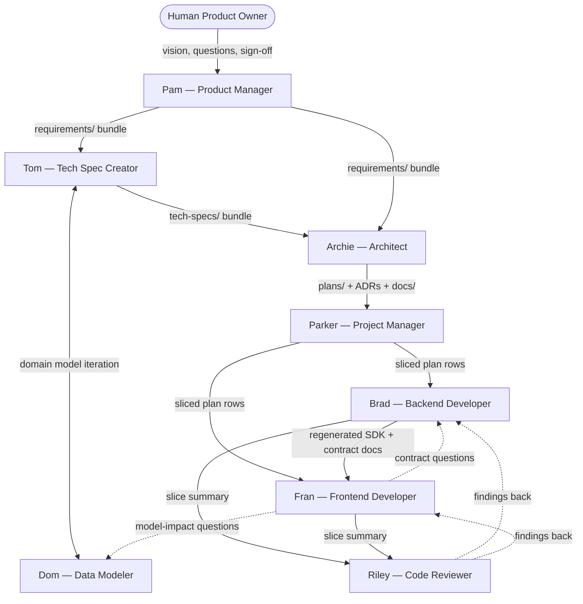

# Persona Flow and Handoffs

This document describes the end-to-end flow through the agent personas, from a product idea to shipped code. It reflects the target state proposed in `plans/01-spec-process-improvement.md`, `plans/02-pam-to-tom-requirements-flow.md`, and `plans/03-archie-brad-fran-handoff-review.md`. Some artifacts referenced here (`tech-specs/`, `docs/adr/`, frontend registries, runbooks) will be scaffolded as those plans land.

---

## 1. Persona Roster

| Persona | Nickname | Scope |
|---|---|---|
| Product Manager | `Pam` | Product intent: requirements, use cases, roles, glossary |
| Technical Specification Creator | `Tom` | Feature-level tech spec: API surface, data flows, orchestrates `Dom` |
| Data Modeler | `Dom` | Domain model: entities, fields, constraints, state machines |
| Architect | `Archie` | Cross-cutting architecture, design plans, infra, ADRs |
| Project Manager | `Parker` | Slicing, sequencing, plan reconciliation |
| Backend Developer | `Brad` | Service, DTOs, mappers, routes, backend tests |
| Frontend Developer | `Fran` | React pages, hooks, components, frontend tests |
| Code Reviewer | `Riley` | Rule/plan/use-case audits, handoff-completeness review |

Formal names remain canonical in plans and rules. Nicknames are shorthand only.

---

## 2. Greenfield Flow (No Existing Product)

### 2.1 Mode A — Vision Only

### 2.2 Mode B — Vision Plus Visual Artifacts

Identical to Mode A except Pam performs a visual-extraction pass first, using the artifacts as anchors for `screens.md` and `navigation-and-entry-points.md` before targeted conversation.

The rest of the flow (`Pam → Tom → Archie → Parker → Brad / Fran → Riley`) is identical to Mode A.

---

## 3. Per-Persona Role, Inputs, Outputs

### 3.1 Pam — Product Manager

- **Role:** Iteratively define product intent with the human owner.
- **Inputs:**
  - Owner's vision and domain knowledge.
  - (Mode B) visual artifacts.
- **Outputs** (`requirements/`):
  - `product-requirements.md`, `roles-and-actors.md`, `glossary.md`, `domain-concepts.md`, `navigation-and-entry-points.md`.
  - Per feature: `overview.md`, `use-cases.md`, `screens.md`, `business-rules.md`, `open-questions.md`.
- **Handoff criteria:** every item carries a confidence label; all `(Inferred)` either upgraded to `(Confirmed)` or paired with an `open-questions.md` entry; owner has signed off end-to-end.
- **Does not produce:** schema, routes, DTOs, state machines, architecture decisions.

### 3.2 Tom — Technical Specification Creator

- **Role:** Translate Pam's requirements into a rebuild-ready technical specification by orchestrating Dom and related capabilities.
- **Inputs:**
  - Pam's complete `requirements/` bundle.
  - `rules/domain-model-conventions-rules.md`.
  - Owner confirmation that the Pam bundle is stable.
- **Outputs** (`tech-specs/`):
  - Per feature: `domain-model.md` (owned by Dom), `api-surface.md`, `flows.md`, `integration-notes.md`, `open-questions.md`.
  - Project-level: `domain-model.md` (consolidated), `error-envelope.md`, `auth-model.md`.
- **Handoff criteria:** every Pam use case has a corresponding technical flow; every route has allowed roles and notable errors; every entity has a fields table and state machine where applicable; `open-questions.md` is empty.
- **Does not produce:** product decisions, architecture decisions, implementation code.

### 3.3 Dom — Data Modeler

- **Role:** Formalize the domain model — fields, types, constraints, cascades, state machines — and enforce conventions from `rules/domain-model-conventions-rules.md`.
- **Inputs:**
  - Pam's `domain-concepts.md` and `business-rules.md`.
  - Tom's request for a technical domain model.
  - Convention rules.
- **Outputs:**
  - `tech-specs/features/<feature>/domain-model.md` (during greenfield, as Tom's subagent).
  - `tech-specs/domain-model.md` (consolidated model, jointly with Tom).
  - Mid-implementation impact classification (UI-only / contract-only / real model change) when routing questions arise.
- **Handoff criteria:** every entity has a fields table with `name | type | nullable | default | constraints`, relationships with cardinality and cascades, and state machines for any lifecycle field.

### 3.4 Archie — Architect

- **Role:** Cross-cutting architecture decisions, design plans, execution planning, CI/CD, deployment, infrastructure.
- **Inputs:**
  - Pam's `requirements/`.
  - Tom's `tech-specs/`.
  - Existing ADRs and architecture docs.
- **Outputs:**
  - `plans/<NN>-<feature>.md` — design plans with diagrams, infra checklist, rollback, feature-flag, observability, perf, and security-review sections.
  - `docs/adr/<NNNN>-<slug>.md` — ADRs for decisions with lifetime beyond a single feature.
  - `docs/ARCHITECTURE.md` — maintained current-state overview.
  - `docs/INFRASTRUCTURE.md` — maintained what-runs-where inventory.
  - `docs/DATABASE-SCHEMA.md` — target schema reference.
- **Handoff criteria:** every plan has a task table; diagrams for flows that cross more than two modules; ADRs captured for durable decisions; current-state docs updated in the same slice as structural changes.

### 3.5 Parker — Project Manager

- **Role:** Shape plans into executable slices, sequence work, reconcile progress.
- **Inputs:**
  - Archie's design plans.
  - Plan task tables as they evolve.
- **Outputs:**
  - Sliced plan rows ready for Brad and Fran to pick up.
  - Sequencing guidance: which slice first, what unblocks what.
  - Reconciliation between implementation reality and plan rows.
- **Handoff criteria:** each slice is independently committable and validatable; dependencies are explicit; task rows reflect current reality.

### 3.6 Brad — Backend Developer

- **Role:** Implement service-layer code against design plans and use cases.
- **Inputs:**
  - Assigned plan row.
  - Referenced use cases and tech-spec files.
  - Rules: service, testing, model-change, workflow.
- **Outputs:**
  - Prisma schema + migration; service/repo logic; Zod DTOs; mappers; Fastify route schemas; regenerated OpenAPI/SDK.
  - Unit, DB-integration, and SDK functional-API tests.
  - Contract documentation inline in DTOs and route descriptions, including request/response examples and pagination/idempotency/timeout semantics for non-trivial routes.
  - Migration runbook for non-trivial migrations.
  - `docs/FEATURE-FLAGS.md` updates when flags change.
  - `docs/RUNBOOKS/` entries for new production-visible surfaces.
  - Slice summary (paragraph + changed-files list) for Riley.
  - Plan row update.
- **Handoff criteria:** full slice-completion checklist from `rules/workflow-rules.md` and contract-documentation checklist from `rules/service-rules.md` satisfied; SDK regenerated and exported before Fran consumes it.

### 3.7 Fran — Frontend Developer

- **Role:** Build the web application against the generated SDK and the reviewed plans/use cases.
- **Inputs:**
  - Assigned plan row.
  - Generated SDK and types from Brad's most recent export.
  - Pam's `use-cases.md` and `screens.md`.
  - Rules: react-ui, ux, testing.
- **Outputs:**
  - React pages, components, and hooks.
  - Vitest unit tests and MSW-backed integration tests.
  - Loading/error/empty/success state handling.
  - Stable `data-testid` selectors.
  - `docs/frontend/COMPONENT-INVENTORY.md` updates when shared components are added.
  - `docs/frontend/ANALYTICS-EVENTS.md` updates when events are emitted.
  - `docs/frontend/ACCESSIBILITY.md` attestation at slice close.
  - Contract-question artifacts when ambiguity arises (structured "what I needed / what docs say / proposed clarification").
  - Slice summary for Riley.
  - Plan row update.
- **Handoff criteria:** does not begin until the SDK/types for the slice actually exist; frontend review checklist from persona file satisfied.

### 3.8 Riley — Code Reviewer

- **Role:** Audit implementation against rules, plans, use cases, and handoff completeness.
- **Inputs:**
  - Slice under review.
  - Corresponding plan row and use cases.
  - Brad's or Fran's slice summary.
  - Rules applicable to the changed modules.
- **Outputs:**
  - Findings table with severity, category, file references, and handoff-gap items.
  - Explicit merge recommendation or block.
- **Handoff criteria:** every finding is either resolved or explicitly accepted with rationale; ADR / runbook / current-state doc gaps are either closed or tracked as follow-up with owner.

---

## 4. Handoff Criteria Summary Table

| From | To | Bundle | Gate |
|---|---|---|---|
| Owner | Pam | Vision, visuals (Mode B) | Conversation started |
| Pam | Tom | `requirements/` bundle | All items labeled; owner signed off; `open-questions.md` classified |
| Tom | Archie | `tech-specs/` bundle | Every use case mapped to flows; every route has roles + errors; domain model complete |
| Tom | Brad / Fran (direct, slice-specific reads) | `tech-specs/features/<feature>/*` | Same as Tom → Archie for the scoped feature |
| Archie | Parker | `plans/` with ADRs and infra docs | Diagrams present; infra checklist complete; rollback plan noted |
| Parker | Brad / Fran | Sliced plan rows | Slices independently committable; dependencies declared |
| Brad | Fran | Regenerated SDK + contract docs | SDK exported; contract-documentation checklist clear; examples present for non-trivial routes |
| Fran | Brad | Contract-question artifact | Question is structured; cites what docs say; proposes doc addition |
| Brad / Fran | Riley | Slice summary + changed files | Slice-completion checklist satisfied; handoff docs updated |
| Riley | Brad / Fran | Findings table | Each finding resolved or explicitly accepted |

---

## 5. Escalation and Ambiguity Routing

- **Product question** (what should this do, who can do it, why) → `Pam`.
- **Technical contract question** (endpoint shape, schema, state machine) → `Tom` during spec; `Brad` during and after implementation.
- **Implementation question** (how to build in the stack) → `Brad` / `Fran` / `Archie` by layer.
- **Model-impact classification** (does this change the domain model?) → `Dom`.
- **Operational question** (how does this run in prod, who is on call) → `Archie` primarily; `Brad` / `Fran` when scoped to their layer.
- **Handoff gap** (doc missing, runbook missing, ADR missing) → `Riley` flags; originating persona fixes.

---

## 6. Cross-Cutting Artifacts

These survive plan archiving and must be kept current by their owning persona:

| Artifact | Owner | Purpose |
|---|---|---|
| `docs/ARCHITECTURE.md` | Archie | Current-state system overview |
| `docs/INFRASTRUCTURE.md` | Archie | What runs where and what depends on what |
| `docs/DATABASE-SCHEMA.md` | Archie | Target schema reference |
| `docs/adr/` | Archie (primary); Brad / Fran propose when relevant | Architecture decision records |
| `docs/FEATURE-FLAGS.md` | Brad | Flag inventory with owner, default, retirement |
| `docs/RUNBOOKS/` | Brad | Per-endpoint or per-job operational guidance |
| `docs/frontend/COMPONENT-INVENTORY.md` | Fran | Shared component registry |
| `docs/frontend/ANALYTICS-EVENTS.md` | Fran | Event registry with payload and owner |
| `docs/frontend/ACCESSIBILITY.md` | Fran | a11y bar, tooling, manual review expectations |
| `docs/DEPLOYMENT-READINESS.md` | Archie | Pre-deploy checklist |
| `CHANGELOG.md` | Archie or Riley at release boundaries | Human-readable change summary |
| `glossary.md` (`requirements/`) | Pam | Canonical terminology |
| `roles-and-actors.md` | Pam | Role definitions and capability matrix |

A slice is not `Done` if it introduces behavior that belongs in one of these artifacts but the artifact wasn't updated in the same slice.

---

## 7. Notes on Current vs Target State

- Pam, Dom, Archie, Parker, Brad, Fran, and Riley personas exist today under `agents/`.
- Abe (Application Specification Builder) is dormant. It is retained for one-time extraction from projects that lack structured requirements but is not part of the active Pam → Tom → Archie → Brad/Fran flow.
- Tom does not yet exist; it will be added as Plan 02 lands.
- Several cross-cutting artifacts in §6 do not yet exist; Plan 03 scaffolds them.
- Workflow rules, rule files, and persona files will be updated to match this flow as Plans 01–03 execute.

Until the plans land, personas should follow their current persona files; this document represents the target state those plans converge toward.
