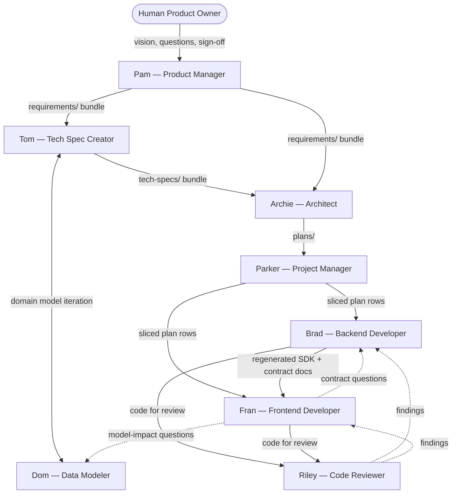
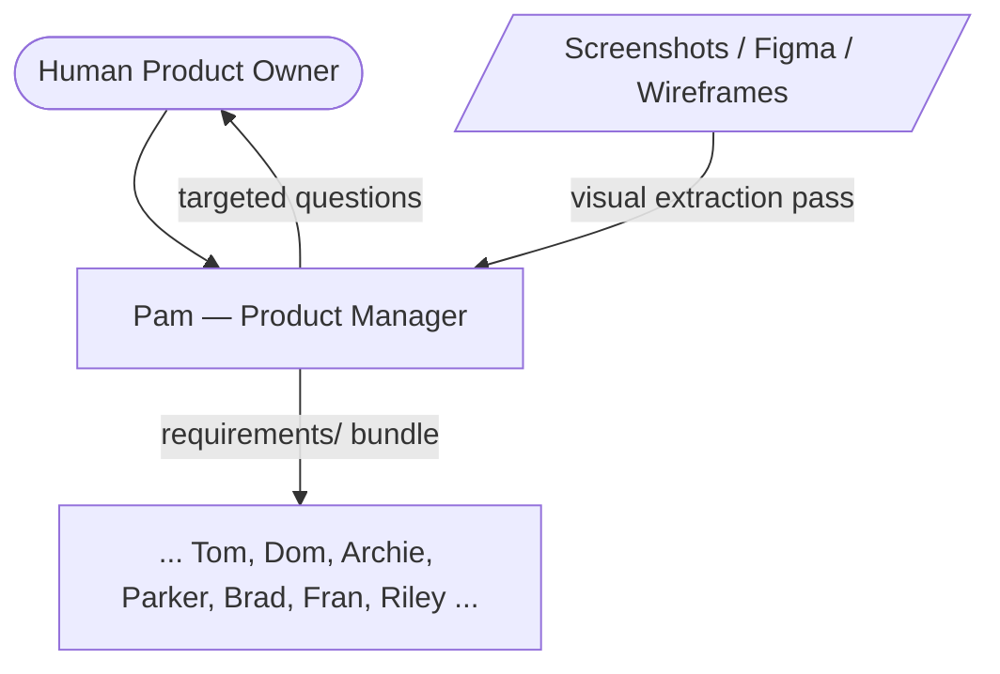

# Persona Flow and Handoffs

This document describes the end-to-end flow through the agent personas, from a product idea to shipped code.

**Active execution plan:** `plans/04-minimal-pam-tom-rollout.md` — tightens Pam, introduces Tom minimally, and leaves Archie/Brad/Fran/Riley untouched. Items marked *(future)* below are proposed in `plans/02-pam-to-tom-requirements-flow.md` and `plans/03-archie-brad-fran-handoff-review.md` and will land after a pilot.

---

## 1. Persona Roster

| Persona | Nickname | Status | Scope |
|---|---|---|---|
| Product Manager | `Pam` | Active | Product intent: requirements, use cases, roles, glossary |
| Technical Specification Creator | `Tom` | New (Plan 04) | Feature-level tech spec: API surface, data flows, orchestrates `Dom` |
| Data Modeler | `Dom` | Active | Domain model: entities, fields, constraints, state machines |
| Architect | `Archie` | Active | Cross-cutting architecture, design plans, infra |
| Project Manager | `Parker` | Active | Slicing, sequencing, plan reconciliation |
| Backend Developer | `Brad` | Active | Service, DTOs, mappers, routes, backend tests |
| Frontend Developer | `Fran` | Active | React pages, hooks, components, frontend tests |
| Code Reviewer | `Riley` | Active | Rule/plan/use-case audits |

Formal names remain canonical in plans and rules. Nicknames are shorthand only.

---

## 2. Flow Diagram

### 2.1 Mode A — Vision Only

### 2.2 Mode B — Vision Plus Visual Artifacts

Identical to Mode A except Pam performs a visual-extraction pass first, using the artifacts as anchors for `screens.md` and `navigation-and-entry-points.md` before targeted conversation.

The rest of the flow is identical to Mode A.

---

## 3. Per-Persona Role, Inputs, Outputs

### 3.1 Pam — Product Manager

- **Role:** Iteratively define product intent with the human owner.
- **Inputs:**
  - Owner's vision and domain knowledge.
  - (Mode B) visual artifacts.
- **Outputs** (`requirements/`):
  - Product-level: `product-requirements.md`, `roles-and-actors.md`, `glossary.md`, `domain-concepts.md`, `navigation-and-entry-points.md`.
  - Per feature: `overview.md`, `use-cases.md`, `screens.md`, `business-rules.md`, `open-questions.md`.
- **Use case template:** Actor, Goal, Confidence label, Preconditions, Normal flow, Alternate flows, Error paths, Postconditions, Acceptance criteria, Business rules referenced.
- **Confidence labels:** `(Confirmed)` / `(Inferred)` / `(Needs Review)` on every use case, screen, and business rule.
- **Handoff criteria:** all files exist; every item labeled; no unclassified open questions; owner signed off end-to-end.
- **Does not produce:** schema, routes, DTOs, field-level types/constraints, state machines, architecture decisions.

### 3.2 Tom — Technical Specification Creator

- **Role:** Convert Pam's owner-confirmed requirements into a feature-level technical specification by orchestrating Dom.
- **Inputs:**
  - Pam's complete `requirements/` bundle with owner sign-off.
  - `rules/domain-model-conventions-rules.md`.
- **Outputs** (`tech-specs/features/<feature-slug>/`):
  - `domain-model.md` (owned by Dom, reviewed by Tom) — fields table, relationships, state machines, invariants.
  - `api-surface.md` — route inventory with method, route, purpose, request/response DTOs, allowed roles, notable errors.
  - `flows.md` — per use case: trigger, screen → API → service → persistence sequence, error branches, state transitions.
  - `open-questions.md`.
  - *(future)* Project-level: consolidated `domain-model.md`, `error-envelope.md`, `auth-model.md`, `integration-notes.md`.
- **Handoff criteria:** every Pam use case has a corresponding flow; every route has roles + errors; every entity has a fields table; `open-questions.md` is empty; naming matches Pam's glossary.
- **Does not produce:** product decisions, architecture decisions, implementation code.

### 3.3 Dom — Data Modeler

- **Role:** Formalize the domain model and enforce conventions from `rules/domain-model-conventions-rules.md`.
- **Inputs:**
  - Pam's `domain-concepts.md` and `business-rules.md`.
  - Tom's request for a technical domain model.
- **Outputs:**
  - `tech-specs/features/<feature>/domain-model.md` (as Tom's subagent during greenfield).
  - Mid-implementation impact classification (UI-only / contract-only / real model change).
- **Handoff criteria:** every entity has a fields table (`name | type | nullable | default | constraints`), relationships with cardinality and cascades, and state machines for lifecycle fields.

### 3.4 Archie — Architect

- **Role:** Cross-cutting architecture decisions, design plans, execution planning, CI/CD, deployment, infrastructure.
- **Inputs:**
  - Pam's `requirements/`.
  - Tom's `tech-specs/`.
- **Outputs:**
  - `plans/<NN>-<feature>.md` — design plans with Key Decisions, Data Model Changes, API Surface, Dependencies, Deferred, and Action Plan task table.
  - `docs/DATABASE-SCHEMA.md` — target schema reference.
  - *(future)* `docs/adr/` — architecture decision records.
  - *(future)* `docs/ARCHITECTURE.md` — current-state system overview.
  - *(future)* `docs/INFRASTRUCTURE.md` — what-runs-where inventory.
  - *(future)* Extended plan template with diagrams, infra checklist, rollback, feature-flag, observability, perf, security-review sections.
- **Handoff criteria:** every plan has a task table; design plans reference the use cases they implement.

### 3.5 Parker — Project Manager

- **Role:** Shape plans into executable slices, sequence work, reconcile progress.
- **Inputs:**
  - Archie's design plans.
  - Plan task tables as they evolve.
- **Outputs:**
  - Sliced plan rows ready for Brad and Fran to pick up.
  - Sequencing guidance: which slice first, what unblocks what.
  - Reconciliation between implementation reality and plan rows.
- **Handoff criteria:** each slice is independently committable and validatable; dependencies are explicit; task rows reflect current reality.

### 3.6 Brad — Backend Developer

- **Role:** Implement service-layer code against design plans and use cases.
- **Inputs:**
  - Assigned plan row.
  - Referenced use cases and tech-spec files.
  - Rules: service, testing, model-change, workflow.
- **Outputs:**
  - Prisma schema + migration; service/repo logic; Zod DTOs; mappers; Fastify route schemas; regenerated OpenAPI/SDK.
  - Unit, DB-integration, and SDK functional-API tests.
  - Contract documentation inline in DTOs and route descriptions.
  - Plan row update.
  - *(future)* Slice summary artifact for Riley.
  - *(future)* Request/response examples and pagination/idempotency/timeout docs for non-trivial routes.
  - *(future)* Migration runbook for non-trivial migrations.
  - *(future)* `docs/FEATURE-FLAGS.md` updates.
  - *(future)* `docs/RUNBOOKS/` entries.
- **Handoff criteria:** full slice-completion checklist from `rules/workflow-rules.md` and contract-documentation checklist from `rules/service-rules.md` satisfied; SDK regenerated and exported before Fran consumes it.

### 3.7 Fran — Frontend Developer

- **Role:** Build the web application against the generated SDK and the reviewed plans/use cases.
- **Inputs:**
  - Assigned plan row.
  - Generated SDK and types from Brad's most recent export.
  - Pam's `use-cases.md` and `screens.md`.
  - Rules: react-ui, ux, testing.
- **Outputs:**
  - React pages, components, and hooks.
  - Vitest unit tests and MSW-backed integration tests.
  - Loading/error/empty/success state handling.
  - Stable `data-testid` selectors.
  - Plan row update.
  - *(future)* Slice summary artifact for Riley.
  - *(future)* Contract-question artifacts (structured format for Brad).
  - *(future)* `docs/frontend/COMPONENT-INVENTORY.md` updates.
  - *(future)* `docs/frontend/ANALYTICS-EVENTS.md` updates.
  - *(future)* `docs/frontend/ACCESSIBILITY.md` attestation.
- **Handoff criteria:** does not begin until the SDK/types for the slice actually exist; frontend review checklist from persona file satisfied.

### 3.8 Riley — Code Reviewer

- **Role:** Audit implementation against rules, plans, and use cases.
- **Inputs:**
  - Slice under review.
  - Corresponding plan row and use cases.
  - Rules applicable to the changed modules.
- **Outputs:**
  - Findings table with severity, category, and file references.
  - Explicit merge recommendation or block.
  - *(future)* Handoff-completeness review (ADR, runbook, current-state doc gaps).
- **Handoff criteria:** every finding is either resolved or explicitly accepted with rationale.

---

## 4. Handoff Criteria Summary Table

| From | To | Bundle | Gate |
|---|---|---|---|
| Owner | Pam | Vision, visuals (Mode B) | Conversation started |
| Pam | Tom | `requirements/` bundle | All items labeled; owner signed off; `open-questions.md` classified |
| Tom | Archie | `tech-specs/` bundle | Every use case mapped to flows; every route has roles + errors; domain model complete |
| Archie | Parker | `plans/` | Task table present; design decisions documented |
| Parker | Brad / Fran | Sliced plan rows | Slices independently committable; dependencies declared |
| Brad | Fran | Regenerated SDK + contract docs | SDK exported; contract-documentation checklist satisfied |
| Fran | Brad | Contract question | Cites what docs say; proposes doc addition |
| Brad / Fran | Riley | Code for review | Slice-completion checklist satisfied |
| Riley | Brad / Fran | Findings table | Each finding resolved or explicitly accepted |

---

## 5. Escalation and Ambiguity Routing

- **Product question** (what should this do, who can do it, why) → `Pam`.
- **Technical contract question** (endpoint shape, schema, state machine) → `Tom` during spec; `Brad` during and after implementation.
- **Implementation question** (how to build in the stack) → `Brad` / `Fran` / `Archie` by layer.
- **Model-impact classification** (does this change the domain model?) → `Dom`.

---

## 6. Cross-Cutting Artifacts

Artifacts that survive plan archiving and must be kept current:

| Artifact | Owner | Status |
|---|---|---|
| `requirements/` | Pam | Active — canonical product requirements |
| `tech-specs/` | Tom + Dom | New (Plan 04) — canonical technical specifications |
| `plans/` | Archie + Parker | Active — design plans and task tables |
| `docs/DATABASE-SCHEMA.md` | Archie | Active |
| `glossary.md` (in `requirements/`) | Pam | Active |
| `roles-and-actors.md` (in `requirements/`) | Pam | Active |
| `docs/ARCHITECTURE.md` | Archie | *(future — Plan 03)* |
| `docs/INFRASTRUCTURE.md` | Archie | *(future — Plan 03)* |
| `docs/adr/` | Archie | *(future — Plan 03)* |
| `docs/FEATURE-FLAGS.md` | Brad | *(future — Plan 03)* |
| `docs/RUNBOOKS/` | Brad | *(future — Plan 03)* |
| `docs/frontend/COMPONENT-INVENTORY.md` | Fran | *(future — Plan 03)* |
| `docs/frontend/ANALYTICS-EVENTS.md` | Fran | *(future — Plan 03)* |
| `docs/frontend/ACCESSIBILITY.md` | Fran | *(future — Plan 03)* |
| `docs/DEPLOYMENT-READINESS.md` | Archie | *(future — Plan 03)* |
| `CHANGELOG.md` | Archie or Riley | *(future — Plan 03)* |

---

## 7. What's Active Now vs What's Next

**Active (Plan 04 — minimal Pam → Tom rollout):**

- Pam produces the full requirements bundle with confidence labels, use-case template, Mode A/B, and handoff floor.
- Tom converts requirements into per-feature tech specs (`domain-model.md`, `api-surface.md`, `flows.md`), orchestrating Dom.
- Dom operates as Tom's subagent during greenfield; existing mid-implementation impact classification is unchanged.
- Archie, Parker, Brad, Fran, and Riley continue using their current persona files with no new output requirements.

**Next (Plans 02 and 03 — after pilot retrospective):**

- Tom: project-level outputs (consolidated domain model, error envelope, auth model, integration notes).
- Archie: ADRs, `docs/ARCHITECTURE.md`, `docs/INFRASTRUCTURE.md`, extended design plan template.
- Brad: slice summary, contract examples, migration runbooks, feature-flag inventory, operational runbooks.
- Fran: structured contract-question format, slice summary, component inventory, analytics events registry, accessibility attestation.
- Riley: handoff-completeness review scope.
- Workflow rules: formal Spec Refinement Loop phase, `rules/product-requirements-rules.md`, `rules/technical-specification-rules.md`.
